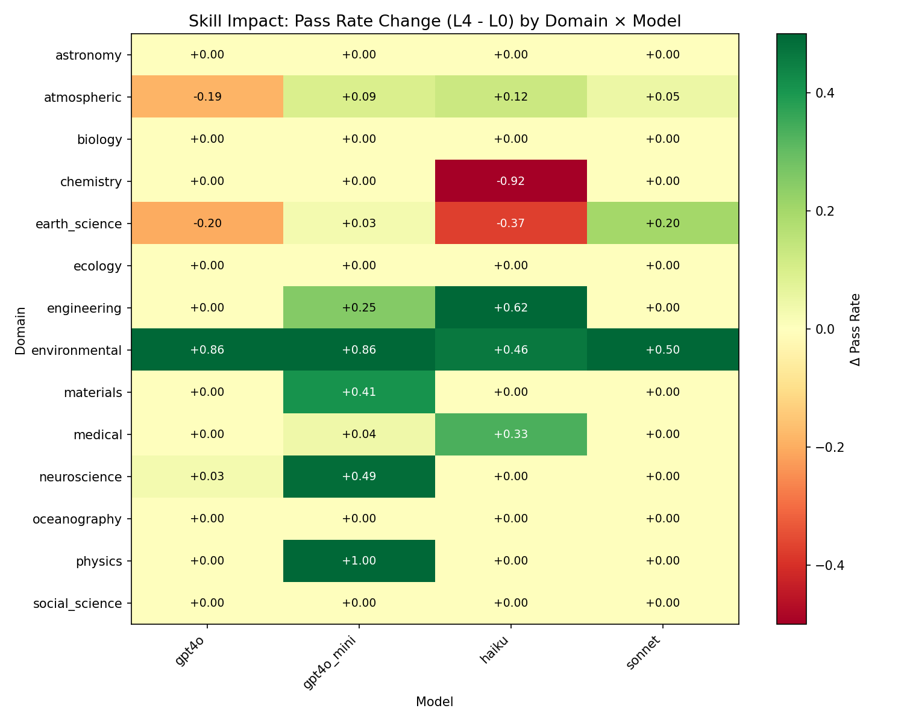
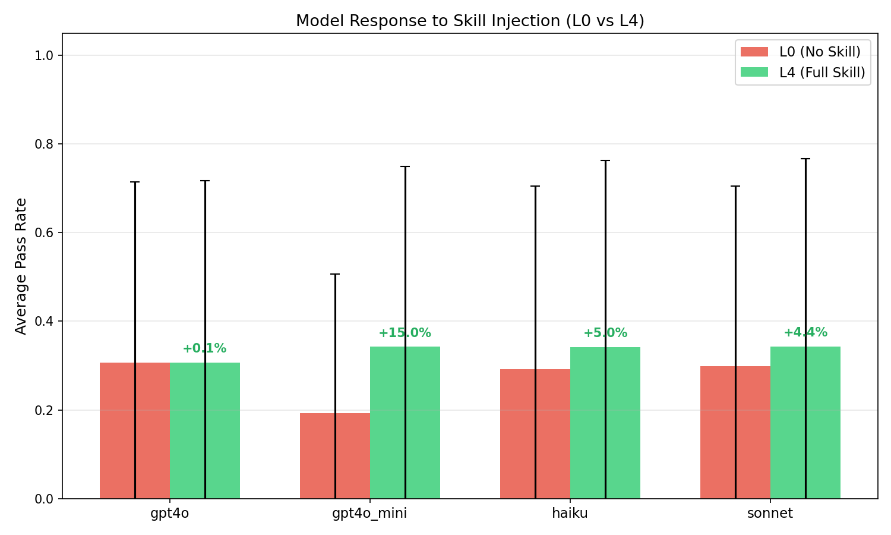

# Skiller

**Large-scale Skill Generation and Validation across 14 Scientific Domains**

> Can structured "skill packages" improve LLM performance on scientific data processing tasks?

## Key Findings

| Finding | Result |
|---------|--------|
| Overall skill impact | L0 27.2% → L4 33.3% (**+6.1%**) |
| Weakest model benefit | GPT-4o-mini: +15.0% (d=0.41) |
| Best domain | Environmental Science: +67.0% (d=1.97) |
| Worst domain | Chemistry: -22.9% (skill backfire) |
| Weak model + skill vs Strong model | GPT-4o-mini+skill (34.2%) > GPT-4o (30.6%) |

### Model Response to Skills

| Model | L0 (No Skill) | L4 (Full Skill) | Δ | Effect Size |
|-------|---------------|-----------------|---|-------------|
| GPT-4o-mini | 19.2% | 34.2% | **+15.0%** | d=0.41 |
| Claude Haiku | 29.2% | 34.1% | +5.0% | d=0.12 |
| Claude Sonnet | 29.9% | 34.3% | +4.4% | d=0.10 |
| GPT-4o | 30.6% | 30.7% | +0.1% | d=0.00 |

### Domain Impact Heatmap



### Model Response Comparison



## What is a Skill Package?

A skill package is a structured knowledge bundle that guides LLMs through domain-specific tasks:

```
skills/astronomy/S032_stellar_spectra/
├── SKILL.md              # Overview, workflow, pitfalls, error handling
├── scripts/
│   ├── main.py           # Complete reference implementation
│   └── requirements.txt  # Dependencies
├── references/
│   ├── workflow.md       # Detailed step-by-step guide
│   └── pitfalls.md       # Common errors and fixes
└── assets/
    └── example_output.md # Expected output format
```

## Experiment Design

- **50 scenarios** across **14 scientific domains**
- **4 models**: Claude Haiku, GPT-4o-mini, GPT-4o, Claude Sonnet
- **400 trials**: 50 scenarios × 4 models × 2 conditions (L0 vs L4)
- **24-point rubric** for skill quality assessment
- All 50 skills scored **23/24**

### Domains Covered

Astronomy, Atmospheric Science, Biology/Genomics, Chemistry, Earth Science, Ecology, Engineering/Signal Processing, Environmental Science, Materials Science, Medical/Epidemiology, Neuroscience, Oceanography, Physics, Social Science

## Project Structure

```
skiller/
├── skiller/              # Core library
│   ├── generate.py       # Skill generation pipeline
│   ├── validate.py       # L0 vs L4 validation experiment
│   ├── score.py          # 24-point rubric scoring
│   └── utils.py          # API client, cost tracking
├── skills/               # 50 generated skill packages (by domain)
├── data/
│   ├── requirements.csv
│   ├── experiment_results.jsonl
│   └── skill_scores.csv
├── analysis/
│   ├── generate_figures.py
│   └── stats_summary.py
├── figures/              # 5 analysis plots
└── docs/
    └── findings_zh.md    # Detailed findings (Chinese)
```

## Usage

### Generate Skills
```bash
python -m skiller.generate --budget 20 --model sonnet
```

### Run Validation Experiment
```bash
python -m skiller.validate --budget 30 --models haiku,gpt4o_mini,gpt4o,sonnet
```

### Generate Analysis Figures
```bash
python analysis/generate_figures.py
```

## Cost

| Phase | Cost |
|-------|------|
| Skill Generation (50 × Sonnet) | $14.45 |
| Validation (400 trials × 4 models) | $12.15 |
| **Total** | **$26.60** |

## License

MIT

---

中文发现报告: [docs/findings_zh.md](docs/findings_zh.md)
