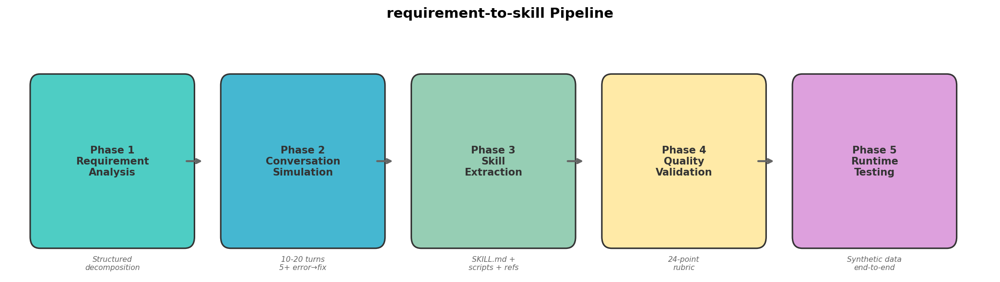
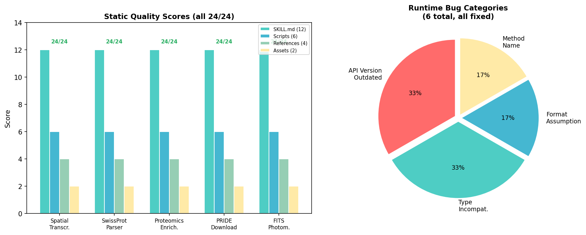
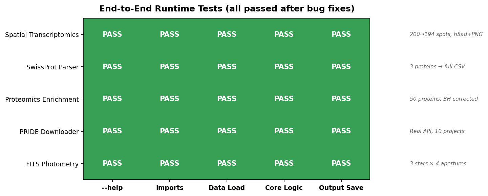

# Skiller — Automated Skill Package Generators for Claude Code

Generate production-quality [Claude Code skill packages](https://docs.anthropic.com/en/docs/claude-code/skills) automatically from conversations or plain-text requirements.

## What Are Skills?

Skills are reusable instruction packages for Claude Code. A well-structured skill teaches Claude domain-specific workflows, error-handling patterns, and tool usage — turning a generic assistant into a domain expert. Each skill is a directory containing:

```
my-skill/
├── SKILL.md              # Core instructions + YAML frontmatter
├── scripts/              # Executable tools (CLI scripts)
├── references/           # Detailed docs (workflow, pitfalls)
└── assets/               # Examples and templates
```

## Two Generators

This repo provides two complementary skill generators:

### 1. `conversation-to-skill` — From Chat Logs

Extracts a skill from an existing AI conversation (ChatGPT export, Claude JSON, OpenAI API format, or plain text).

**Best for**: When you already have a conversation where a problem was solved through trial-and-error.

```bash
# Automated (requires ANTHROPIC_API_KEY)
python conversation-to-skill/scripts/generate_skill.py conversation.json -o output/

# Or follow the manual workflow
# See conversation-to-skill/references/manual-workflow.md
```

**How it works**:
1. Parse conversation → tag turns as [PROBLEM], [ERROR], [FIX], [SUCCESS]
2. Extract the final working code, workflow, and all pitfalls
3. Package into a multi-file skill directory
4. Validate against quality checklist

### 2. `requirement-to-skill` — From Text Requirements

Generates a skill from a plain-language requirement description — no conversation needed.

**Best for**: When you know what skill you need but don't have a conversation about it.



**How it works**:
1. **Analyze** the requirement (core task, I/O, challenges, domain pitfalls)
2. **Construct** a realistic 10-20 turn conversation with 5+ error→fix iterations
3. **Extract** the skill using conversation-to-skill
4. **Validate** against the 24-point skill-metric rubric
5. **Test** code usability (`--help` + synthetic data end-to-end)

The key insight: real conversations produce high-quality skills because they contain realistic error→fix iterations. This generator constructs such conversations synthetically, then extracts the skill from them.

## Quality Assurance

Both generators target **24/24** on the [skill-metric rubric](https://github.com/anthropics/claude-code/blob/main/skill-metric), which evaluates:

| Dimension | Points | What It Checks |
|-----------|--------|----------------|
| Format | 8 | SKILL.md structure, YAML frontmatter, naming conventions |
| Completeness | 8 | license, compatibility, metadata, scripts/references/assets dirs |
| Writing | 8 | Task boundaries, trigger signals, cross-references, English content |

## Comparison with Anthropic's Official Skill Creator

We ran a controlled experiment comparing three systems on the same task (neuroscience metadata generation):

| System | skill-metric | Practical Test (7 assertions × 3 evals) | Automation |
|--------|-------------|----------------------------------------|------------|
| **conversation-to-skill** | 24/24 | 21/21 (100%) | Fully automated |
| **requirement-to-skill** | 24/24 | 21/21 (100%) | Minimal input |
| Anthropic skill-creator | 19/24 | 21/21 (100%) | Interactive |
| No-skill baseline | N/A | 9/21 (43%) | N/A |

**Key finding**: All three systems are functionally equivalent (100% practical test pass rate), but our generators require significantly less human interaction and consistently hit 24/24 on structural quality. The 5-point difference from the official tool reflects design philosophy (our templates embed the scoring rubric), not quality.

**Skills improve task completion by +57 percentage points** (43% → 100%) compared to no-skill baseline.

## Real-World Examples

The `examples/` directory contains **5 skills generated from real scientist requirements** using the `requirement-to-skill` pipeline. These are not toy demos — they were derived from actual data processing needs collected from researchers across multiple scientific domains, then validated through both static quality checks and end-to-end runtime testing with synthetic data.

| Skill | Domain | Description | Lines of Code |
|-------|--------|-------------|:---:|
| [`spatial-transcriptomics-preprocess`](examples/spatial-transcriptomics-preprocess/) | Genomics | DLPFC spatial transcriptomics QC, normalization, dimensionality reduction, and clustering | 230 |
| [`swissprot-protein-parser`](examples/swissprot-protein-parser/) | Proteomics | Parse SwissProt JSON protein database into structured CSV/JSON with streaming batch processing | 301 |
| [`proteomics-enrichment-analysis`](examples/proteomics-enrichment-analysis/) | Proteomics | Differential protein expression analysis with GO/KEGG pathway enrichment and visualization | 330 |
| [`pride-proteomics-downloader`](examples/pride-proteomics-downloader/) | Proteomics | Search and download FragPipe-processed projects from PRIDE database via REST API | 288 |
| [`fits-aperture-photometry`](examples/fits-aperture-photometry/) | Astronomy | Multi-strategy aperture photometry on FITS images with WCS, bad pixel masking, and error propagation | 355 |

### Validation Results

All 5 examples scored **24/24** on the quality rubric and passed end-to-end runtime testing:





### Runtime Bug Patterns

Static analysis (24/24) cannot catch all issues. End-to-end testing with synthetic data revealed **6 bugs** across the 5 skills, all of which were fixed:

| Bug Type | Count | Example |
|----------|:-----:|---------|
| API version outdated | 2 | PRIDE v1 endpoint deprecated; scanpy plotting API changed |
| Type incompatibility | 2 | astropy Quantity vs pandas DataFrame; photutils position format |
| Format assumption | 1 | Only supported 10X `.h5`, not `.h5ad` input format |
| Method name error | 1 | `var_names_unique()` → `var_names_make_unique()` |

**Takeaway**: LLM-generated code requires runtime validation — static quality checks alone are insufficient.

### Generation Cost

Each skill costs approximately **$0.30** to generate using Claude Sonnet (total: $1.52 for all 5).

## Repository Structure

```
skiller/
├── conversation-to-skill/          # Generator 1: Chat log → Skill
│   ├── SKILL.md
│   ├── scripts/
│   │   ├── generate_skill.py
│   │   └── generate_test_conversations.py
│   ├── references/
│   │   ├── manual-workflow.md
│   │   ├── quality-checklist.md
│   │   └── skill-template.md
│   └── assets/
│       └── example_output.md
│
├── requirement-to-skill/           # Generator 2: Requirements → Skill
│   ├── SKILL.md
│   ├── scripts/
│   │   ├── main.py
│   │   └── requirements.txt
│   ├── references/
│   │   ├── workflow.md
│   │   ├── conversation_design.md
│   │   └── pitfalls.md
│   └── assets/
│       └── example_output.md
│
├── examples/                       # 5 real-world generated skills
│   ├── spatial-transcriptomics-preprocess/
│   ├── swissprot-protein-parser/
│   ├── proteomics-enrichment-analysis/
│   ├── pride-proteomics-downloader/
│   └── fits-aperture-photometry/
│
├── assets/                         # Figures for documentation
│   ├── pipeline_overview.png
│   ├── quality_and_bugs.png
│   └── runtime_tests.png
│
├── LICENSE                         # MIT
└── README.md
```

## Installation

### As Claude Code Skills

Copy the skill directories to your Claude Code custom instructions path:

```bash
# Clone
git clone https://github.com/qishisuren123/skiller.git

# Copy to your project's .claude/ directory
cp -r skiller/conversation-to-skill /path/to/your/project/.claude/skills/
cp -r skiller/requirement-to-skill /path/to/your/project/.claude/skills/
```

### For Automated Generation

```bash
pip install anthropic  # Required for generate_skill.py
export ANTHROPIC_API_KEY=your-key-here

python conversation-to-skill/scripts/generate_skill.py your_conversation.json -o output/
```

## Requirements

- Python >= 3.9
- `anthropic >= 0.39.0` (for automated generation only)
- No external dependencies for manual workflow

## YAML Compatibility Note

A critical lesson from development: **never use YAML block scalars** (`>`, `>-`, `|`, `|-`) in SKILL.md frontmatter. Different YAML parsers handle them inconsistently. Always use single-line double-quoted strings:

```yaml
# WRONG - breaks simple parsers
description: >-
  This is a multi-line
  description that folds.

# CORRECT - works everywhere
description: "This is a single-line description that all parsers read correctly."
```

## License

MIT
